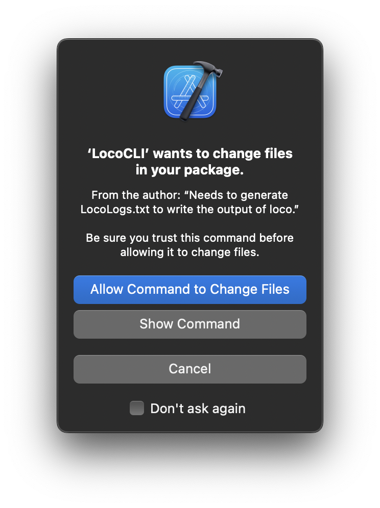
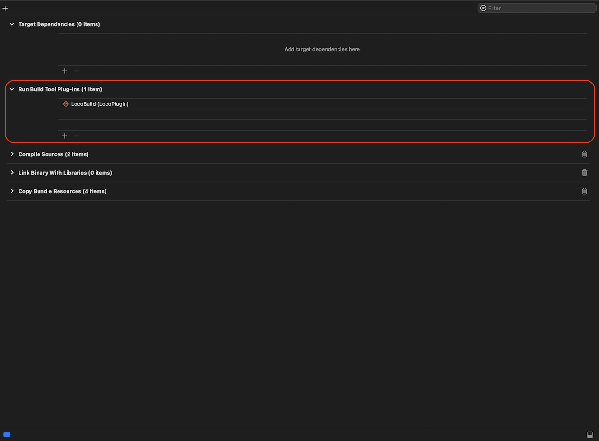

# What is LocoPlugin

This plugin is a SPM Plugin wrapper around the awesome [loco](https://github.com/konrad1977/loco) linter.

# What is included

LocoPlugin supports 2 ways of running the plugin:

1. LocoCLI (CommandPlugin)     | Get output into a txt file.
2. LocoBuild (BuildToolPlugin) | Integrated into Xcode.

# LocoCLI

**1. Run the plugin**

_Via terminal_

```bash
# In your working directory
swift package plugin loco-analyze
```

_Via Xcode 14_

- Open the context menu
- Select LocoPlugin

**2. Allow permission**

Allow writing to working directory as LocoPlugin will create a LocoLogs.txt files that will hold the output of loco.



**3. Output**
`LocoLogs.txt` file will be created in your working directory which holds the output of loco.

# LocoBuild

**1. Add LocoBuild to Build Tool Plug-ins**


**2. Build your project**

This will trigger the plugin to run on each run.

**3. Allow the plugin to run**

We need to allow the plugin to run in the context of *Xcode*.

